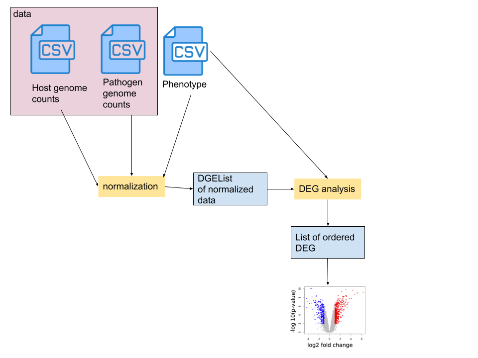

```{r setup, include=FALSE}
knitr::opts_chunk$set(echo = TRUE)
```

## Description

rnaDualSeq is an R package to house functions that help facilitate and visualize differentially expressed genes within host-pathogen infection studies. This tool will analyze the transcriptome related to bacterial infections of eukaryotic cells. Pathogens cause profound transcriptomic remodelling of the host during infection. They cause the expression of unique genes that ensure their survival and allow them to replicate within the host. Dual RNA sequencing studies allow researchers to identify hidden molecular phenotypes of virulence-associated small noncoding RNAs that were not visible in standard infection assays. This package can use read counts from genes of either host or pathogen and reports the differentially expressed genes visually via volcano plots.

The rnaDualSeq package was developed using R version 4.2.1 (2022-06-23), platform x86_64-apple-darwin17.0 and Running under: macOS Mojave 10.14

## Installation

To run latest version of package:

```bash
require("devtools")
devtools::install_github("smnthpang/rnaDualSeq", build_vignettes = TRUE)
library("rnaDualSeq")
```
To run shinyApp: Under construction

## Overview

```python
ls("package:rnaDualSeq")
data(package = "rnaDualSeq")
```

rnaDualSeq has functions that

- read in an input data file containing the read counts of a genes where samples are matched to different time periods in sections of hours (see read_csv)
- read in a phenotype file that describes the sample to groups (see read_csv)
- normalises the raw counts within the data file by using the trimmed mean of M-values (TMM) to correct for RNA composition differences. After that, the normalised data is log2 transformed. (see function norm_TMM)
- identifies differentially expressed genes using pathogen and host genome as inputs and sorts them by time period (see function identifyDE)
- visualizes the differentially expressed genes by plotting each time period on a volcano plot where upregulated/downregulated genes are labeled (see function volcanoPlot)

See vignettes for tutorial on package:
```bash
browseVignettes("rnaDualSeq")
```
An overview of the package is illustrated below:



## Contributing
The author of this package is Samantha Pang. 

The read_csv() uses the utils package to read in a file in table format and creates a data frame from it. The norm_TMM() function uses the edgeR package to create a DGEList and uses cpm (counts per million) function and the normalization method of TMM (trimmed mean of M-values). The normalized data is also log2 transformed. The indentifyDE() function uses limma package to identify differentially expressed genes. makeConstrasts function from limma package allows for a contrast matrix using time slots as set of parameters to be made. The volcanoPlot() functions uses ggplot2 package to create a graph of differentially expressed genes. They also uses ggsave function to store pdfs of the visualizations into a folder labelled by time period. 


## References 

Dinarvand, M., Kock, F., Al Mouiee, D., Vuong, K., Vijayan, A., Tanzim, A. F., Azad, A. K. M., Penesyan, A., Castaño-Rodríguez, N., &amp; Vafaee, F. (2022). DSEQSB: A Systems Biology Approach to decipher dynamics of host-pathogen interactions using temporal dual RNA-Seq Data. https://doi.org/10.1101/2022.02.28.482417 

Doyle, M. (2022, October 18). Galaxy training: Visualization of RNA-seq results with volcano plot in R. Galaxy Training Network. Retrieved November 15, 2022, from https://training.galaxyproject.org/training-material/topics/transcriptomics/tutorials/rna-seq-viz-with-volcanoplot-r/tutorial.html 

Love, M. I., Anders, S., Kim, V., &amp; Huber, W. (n.d.). RNA-seq workflow: gene-level exploratory analysis and differential expression. RNA-seq workflow: Gene-level exploratory analysis and differential expression. Retrieved November 15, 2022, from https://www.bioconductor.org/packages/devel/workflows/vignettes/rnaseqGene/inst/doc/rnaseqGene.html 

Walch, P., Selkrig, J., Knodler, L. A., Rettel, M., Stein, F., Fernandez, K., Viéitez, C., Potel, C. M., Scholzen, K., Geyer, M., Rottner, K., Steele-Mortimer, O., Savitski, M. M., Holden, D. W., &amp; Typas, A. (2021). Global mapping of salmonella enterica-host protein-protein interactions during infection. Cell Host &amp; Microbe, 29(8). https://doi.org/10.1016/j.chom.2021.06.004 

Westermann, A. J., Förstner, K. U., Amman, F., Barquist, L., Chao, Y., Schulte, L. N., Müller, L., Reinhardt, R., Stadler, P. F., &amp; Vogel, J. (2016). Dual RNA-seq unveils noncoding RNA functions in host–pathogen interactions. Nature, 529(7587), 496–501. https://doi.org/10.1038/nature16547 

Macho Rendón, J., Lang, B., Ramos Llorens, M., Tartaglia, G.G., and Torrent Burgas, M. (2021). DualSeqDB: a database to assess the relevance of bacterial genes during host infection. Nucleic Acids Res. 49, D687–D693.

R Core Team (2022). R: A language and environment for statistical
computing. R Foundation for Statistical Computing, Vienna, Austria.
URL https://www.R-project.org/.

Ritchie ME, Phipson B, Wu D, Hu Y, Law CW, Shi W, Smyth GK (2015). “limma powers differential expression analyses for RNA-sequencing and microarray studies.” Nucleic Acids Research, 43(7), e47. doi: 10.1093/nar/gkv007.
Wickham H (2016). ggplot2: Elegant Graphics for Data Analysis. Springer-Verlag New York. ISBN 978-3-319-24277-4, https://ggplot2.tidyverse.org.

Robinson MD, McCarthy DJ and Smyth GK (2010). edgeR: a
  Bioconductor package for differential expression analysis of
  digital gene expression data. Bioinformatics 26, 139-140
  
Robinson MD, McCarthy DJ and Smyth GK (2010). edgeR: a
  Bioconductor package for differential expression analysis of
  digital gene expression data. Bioinformatics 26, 139-140

## Acknowledgements 
This package was developed as part of an assessment for 2022
BCB410H: Applied Bioinformatics course at the University of
Toronto, Toronto, CANADA. <PackageName>welcomes issues,
enhancement requests, and other contributions. To submit an issue,
use the GitHub issues
